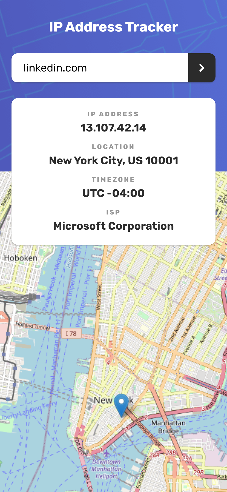

# IP Address Tracker
Project developed from a Frontend Mentor challenge. The main purpose is to make an IP Address Tracker app integrating different technologies.

## Get Started

### Install
```bash
yarn
```
or
```bash
npm install
```

### Start
```bash
yarn start
```
or
```bash
npm run start
```

## Demo
Check the result [here](https://ip-address-tracker-juancaricodev.netlify.app/)!

## Preview

### Desktop Version


### Mobile Version
<!--  -->


## Features

* Search by IP
* Search by Domain

## Stack
* React
* Webpack
* SASS (SCSS)
* LeafletJS
* ipify

## Author
Juan Camilo Rico Orjuela - <juancaricodev@gmail.com>

## License
[](https://github.com/juancaricodev/ip-address-tracker/blob/main/LICENSE)
